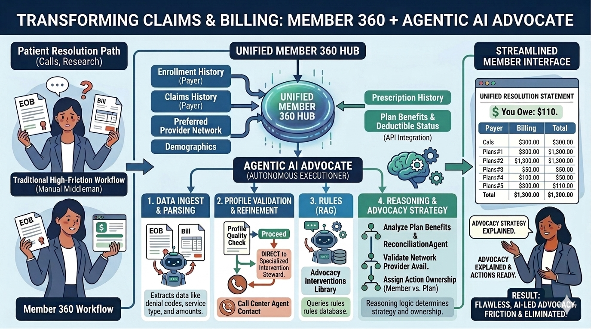
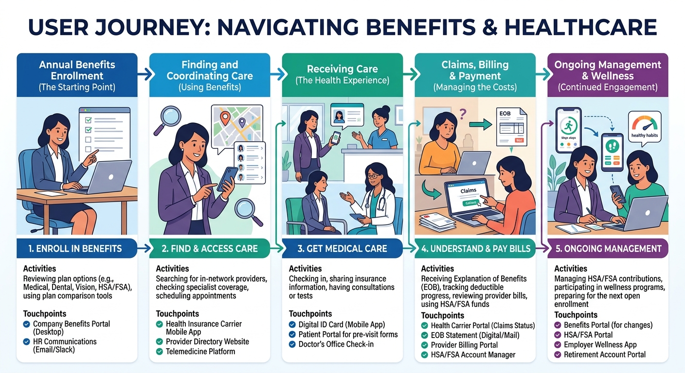
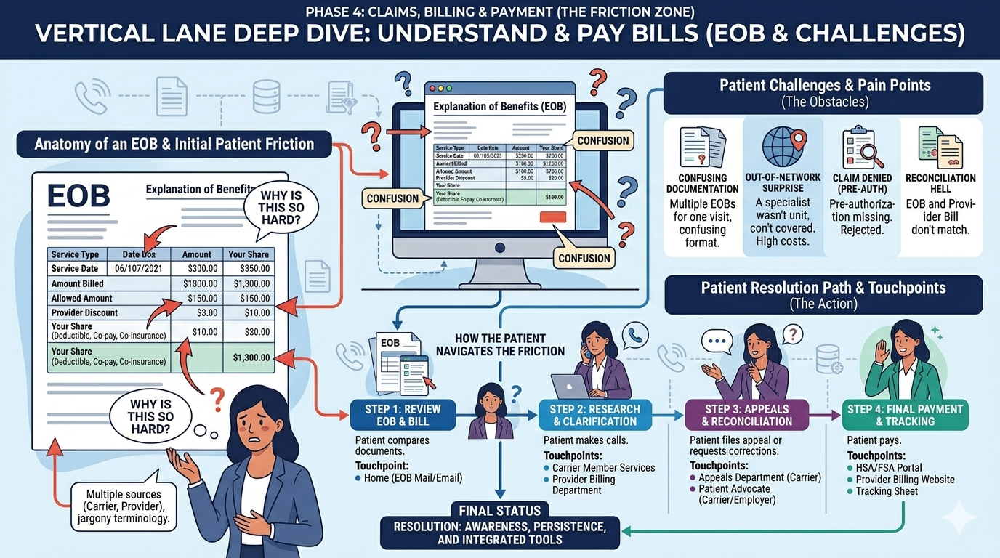

# Member 360 — Agentic Experience Layer

When a health insurance claim is denied, the member receives an Explanation of Benefits containing a CARC code — a short identifier that maps to an adjudication decision most members cannot decode. They get a bill. They do not know if the denial is correct, whose responsibility it is to resolve, or whether they have grounds to appeal.

Less than 1% of denied claims are ever appealed. Of the people who do appeal, 44% win.

Member 360 is an interpretation layer that sits between the adjudication engine and the member. It reads the denial outcome, retrieves the specific plan rule behind the decision, and tells the member exactly what happened — who owns the problem, what to say, and what to do next.

**This system does not decide if a claim is paid.** The adjudication engine holds that authority. Member 360 reads its output and translates it.



> **Try the demo:** Clone the repo and run `./demo.sh` — no backend, no internet required.

---

## Table of Contents

- [The Problem](#the-problem)
- [The Solution](#the-solution)
- [Demo](#demo)
- [Why This Architecture](#why-this-architecture)
- [Quickstart](#quickstart)
- [How It Works](#how-it-works)
- [API Endpoints](#api-endpoints)
- [Project Structure](#project-structure)
- [Tech Stack](#tech-stack)
- [Roadmap](#roadmap)

---

## The Problem

Enrollment platforms, provider directories, telemedicine services, and wellness apps are categories with dozens of well-funded products in each. The phase that follows a processed claim — understanding what the insurer decided, reconciling it against the bill, and knowing what to do if the decision is wrong — has tools, but they were built for plan administrators, not members.



The primary tool available to a member is the Explanation of Benefits. It was not designed to be understood. It contains adjustment codes, line-item amounts, and provider discounts that do not obviously reconcile with each other or with the bill arriving separately in the mail.



The consequence is a systematic failure to advocate:

| Metric | Figure | Source |
|---|---|---|
| Denied in-network claims per year | 8.8M+ | CMS Transparency PUF, 2024 |
| Members who ever appeal a denial | < 1% | KFF, 2025 |
| Appeals that are overturned | 44% | KFF, 2025 |
| Annual cost to overturn denials | $18B — 70% eventually paid | AHA, 2025 |

The gap between the second and third rows is the problem this system addresses. Most members never appeal not because the denial is correct, but because they do not have the domain knowledge to know they can — or how.

---

## The Solution

Member 360 runs a five-step pipeline on every claim:

```
EOB Input → Parse → Lookup Denial Code → Retrieve Plan Rule → Reason → Output
```

The output is the same for every claim:

- **What happened** — Plain-English explanation of the denial. No codes, no jargon.
- **The plan rule** — The exact SBC section that applies, cited by name so the member can verify it independently.
- **Who owns it** — Whether this is the provider's problem to fix or the member's, with the reasoning behind that assignment.
- **What to say** — A word-for-word call script with the claim ID, date of service, and provider NPI already filled in.
- **What you owe** — Deductible progress, OOP status, and the actual member liability — separate from what the provider billed.
- **How to appeal** — Deadlines, the right department to contact, and escalation paths if the first call doesn't resolve it.

---

## Demo

The offline demo runs in the browser with no backend and no internet connection.

### V2 — Five Concurrent Claims

The V2 demo shows the agent working through five active claims at once, each with a different denial type and resolution path:

| Claim | Status | Service | Member Owes | Scenario |
|---|---|---|---|---|
| SFP-01 | DENIED | MRI — Right Knee | $1,250 | CO-197: prior auth not obtained |
| SFP-02 | APPROVED | Annual Wellness | $0 | Preventive care, 100% covered |
| SFP-03 | PARTIAL | Physical Therapy x6 | $220 | CO-45: benefit limit reached |
| SFP-04 | PENDING | Dermatology Visit | TBD | Network status unresolved |
| SFP-05 | DENIED | Emergency Room | $2,800 | No Surprises Act applies |

For each claim, the agent walks through: what happened, who is responsible, what to say, what you owe, and how to appeal — in sequence, without the member needing to know what a CARC code is.

### V1 — Single Claim

The V1 demo covers a single denied MRI claim from start to finish: tool-chain animation, denial explanation, call script, and financial summary.

```bash
git clone https://github.com/sandeepbarhanpure-ui/member-360-agentic-experience-layer.git
cd member-360-agentic-experience-layer
./demo.sh
# Opens at http://127.0.0.1:8888
```

---

## Why This Architecture

### The case against a pure LLM approach

Healthcare claims have no tolerance for a confident wrong answer. If the system tells a member "this is the provider's responsibility" when it is actually a deductible charge, that is a compliance problem — not a user experience problem. The member may withhold payment from the provider or file a dispute based on incorrect information.

CARC codes have exact, published meanings. There is no interpretation required. Sending a denial code through a language model to produce an explanation introduces variance where none belongs. The right tool for a lookup is a lookup.

The same applies to plan rule retrieval. The denial mapping references a specific SBC section. Retrieving that section is a scoped operation, not a general search. Running a broad semantic search over the full plan document when you already know exactly which section applies is solving the wrong problem.

The LLM belongs in the conversation layer — natural language, follow-up questions, personalized scripts — where probabilistic outputs are appropriate. The interpretation pipeline underneath it needs to be deterministic and produce the same answer every time.

### How the architecture enforces this

| Pipeline Step | Approach | Reason |
|---|---|---|
| Denial code → explanation | Deterministic JSON lookup | Codes have exact meanings. Inference introduces variance that does not exist in the source data. |
| Plan rule retrieval | Scoped RAG (section-level) | The denial mapping already names the SBC section. Retrieval is targeted, not exploratory. |
| Consistency check | Rule-based logic | Facility type exceptions, timeline validation, and action ownership are binary conditions. |
| Member conversation | LLM-ready | Natural language and personalization belong here, where the probabilistic nature of the model is an asset. |

**Hard constraint in the code:** if a denial code is not in the mapping, the system returns an explicit `cannot_interpret` response and directs the member to Member Services. It does not attempt to infer a meaning from an unknown code.

### The data swap point

Every router, service, and frontend component is built against stable Pydantic interfaces. All synthetic data lives in one file: `synthetic_data.py`. Connecting real data — a member database, a claims system, a plan document store — is a one-file change. Nothing else in the codebase needs to know about it.

```
synthetic_data.py  ←  the only file that changes when connecting real data
     ↓
  MemberProfile  →  routers  →  frontend
  ClaimSummary   →  services
  DenialMapping  →  chat agent
```

### The auditable pipeline

Every step is logged and shown to the member in real time. There is no black box:

```
→ Reading EOB...           [Claim #SFP-01 · CO-197 · MRI Knee]
→ Looking up denial...     [CO-197: Prior Authorization Absent]
→ Retrieving plan rule...  [SBC Section: Advanced Imaging]
→ Reasoning...             [Facility: Outpatient · No ER exception applies]
→ Generating script...     [Action owner: Provider]
```

The member can see what the system did and verify the reasoning against their plan documents.

---

## Quickstart

### Full application (FastAPI + React)

```bash
git clone https://github.com/sandeepbarhanpure-ui/member-360-agentic-experience-layer.git
cd member-360-agentic-experience-layer/backend

python3 -m venv .venv
source .venv/bin/activate
pip install -r requirements.txt

uvicorn app.main:app --reload --port 3000
```

Open `http://localhost:3000`. The app has four pages:

| Page | What it does |
|---|---|
| **Chat Agent** | Conversational UI — 7 flows, animated tool-chain visualization |
| **Dashboard** | Members table, claims table, denial metrics |
| **Reconcile** | Paste any EOB text and get a full analysis |
| **Denial Codes** | All recognized CARC codes in plain English |

API docs at `http://localhost:3000/docs`.

### Offline demo (no backend)

```bash
./demo.sh
# Opens at http://127.0.0.1:8888
```

---

## How It Works

### Step 1 — Parse

`EOBParser` reads raw EOB text and extracts: denial code, service type, facility, billed amount, allowed amount, member liability, service date, and provider NPI.

### Step 2 — Lookup

The denial code is matched against `denial_mapping.json`. If the code is not present, the system returns `cannot_interpret` and stops. It does not attempt to infer a meaning from context.

### Step 3 — Retrieve

`SBCRetriever` reads the `sbc_section` field from the denial mapping and retrieves the corresponding plan rule. The retrieval is targeted to that section — not a full-document search. The architecture is FAISS/vector-store ready for production document stores.

### Step 4 — Reason

`ReconciliationAgent` compares the EOB against the retrieved plan rule:
- Checks facility type against exception conditions (an ER prior-auth waiver, for example)
- Validates service dates against filing deadlines
- Determines whether the denial is consistent with the plan rules as written
- Assigns action ownership: Provider, Member, or Plan

### Step 5 — Output

The system produces a resolution statement containing:
- Plain-English explanation of what happened and why
- The SBC section that applies, cited by name
- Action owner assignment with the rule that determined it
- Pre-filled call script — claim ID, date of service, and provider NPI included
- Appeal deadlines and escalation paths
- Financial reconciliation across deductible, coinsurance, and OOP maximum

---

## API Endpoints

| Endpoint | Method | Description |
|---|---|---|
| `/api/health` | GET | System health |
| `/api/members` | GET | List members |
| `/api/members/{id}` | GET | Single member profile |
| `/api/claims` | GET | Claims list — `?member_id=` filter |
| `/api/denial-codes` | GET | All recognized CARC codes |
| `/api/reconcile` | POST | Full reconciliation pipeline |
| `/api/chat` | POST | Chat message → agent response |
| `/api/chat/greeting` | GET | Initial member greeting |
| `/docs` | GET | Swagger UI |

```bash
# Reconcile an EOB
curl -X POST http://localhost:3000/api/reconcile \
  -H "Content-Type: application/json" \
  -d '{"eob_text": "CLAIM STATUS: DENIED\nCode: CO-197\nService: MRI Knee"}'

# Chat with the agent
curl -X POST http://localhost:3000/api/chat \
  -H "Content-Type: application/json" \
  -d '{"message": "Why was my MRI claim denied?"}'
```

---

## Supported Denial Codes

| Code | Meaning | Action Owner |
|---|---|---|
| CO-197 | Prior Authorization Absent | Provider |
| CO-16 | Missing or Incomplete Medical Records | Provider |
| CO-4 | Procedure-Modifier Inconsistency | Provider |
| CO-29 | Filing Deadline Exceeded | Provider |
| CO-45 | Benefit Limit Reached | Member |
| PR-1 | Member Deductible Applies | Member |
| PR-2 | Coinsurance Applies | Member |

---

## Project Structure

```
member-360-agentic-experience-layer/
├── backend/
│   ├── app/
│   │   ├── main.py
│   │   ├── routers/                 # HTTP layer — no business logic
│   │   │   ├── members.py
│   │   │   ├── claims.py
│   │   │   ├── reconcile.py
│   │   │   └── chat.py
│   │   ├── services/
│   │   │   ├── eob_parser.py        # EOB text → EOBRecord
│   │   │   ├── denial_lookup.py     # CARC code → DenialMapping
│   │   │   ├── sbc_retriever.py     # Plan rule retrieval
│   │   │   ├── reconciliation.py    # Core reasoning pipeline
│   │   │   ├── chat_agent.py        # 7 conversation flows
│   │   │   └── synthetic_data.py    # ← swap this for real data
│   │   └── models/
│   │       └── schemas.py
│   └── data/
│       ├── denial_mapping.json      # CARC code → plain-language mapping
│       ├── mock_eob.txt
│       └── synthetic_sbc.md
├── frontend/
│   ├── index.html
│   └── components/
│       ├── app_shell.jsx            # 4-page shell
│       ├── chat.jsx
│       ├── chat_ui.jsx
│       ├── chat_cards.jsx
│       ├── chat_tools.jsx           # Tool-chain visualization
│       └── member_panel.jsx
├── prototypes/
│   └── demo/                        # Offline demo — no server needed
│       ├── index.html
│       ├── chat.html                # V1 single-claim
│       ├── chat_v2.html             # V2 multi-claim
│       ├── member360_chat.jsx
│       ├── member360_chat_v2.jsx
│       ├── member360_chat_v2_data.jsx
│       ├── member360_prototype.jsx
│       ├── member360_architecture.jsx
│       └── start_demo.sh
├── docs/
│   ├── architecture/
│   │   ├── member360_solution_architecture.png
│   │   ├── journey_map_overview.png
│   │   ├── phase4_friction_deep_dive.png
│   │   └── member360_architecture_diagram.svg
│   └── product/
│       ├── PRODUCT_THINKING.md
│       └── ROADMAP.md
├── archive/
│   └── v1-streamlit/
│       ├── app.py                   # Original 850-line prototype
│       └── README-original.md
├── tests/
│   └── test_agent.py
├── demo.sh
├── README.md
└── LICENSE
```

---

## Tech Stack

### v2 (current)

| Layer | Technology |
|---|---|
| Backend | FastAPI · Python 3.11+ · Pydantic v2 |
| Frontend | React 18 (CDN) · Tailwind CSS · Babel |
| Retrieval | Deterministic JSON · FAISS/LangChain ready |
| Data | Synthetic JSON — one-file swap point |
| API Docs | Swagger UI (auto-generated by FastAPI) |

### v1 (archived)

| Layer | Technology |
|---|---|
| Backend | Streamlit · LangChain |
| Retrieval | FAISS · HuggingFace all-MiniLM-L6-v2 |
| Frontend | Standalone React JSX prototypes |

The v1 prototype used real RAG retrieval with FAISS embeddings and proved the concept. The v2 architecture replaced the Streamlit monolith with a clean FastAPI + React separation, isolated the data layer to a single file, and extended the demo to cover five concurrent claims across different denial types.

---

## Roadmap

Full detail in [`docs/product/ROADMAP.md`](docs/product/ROADMAP.md).

| Phase | Work | Scope |
|---|---|---|
| 1 | Replace `synthetic_data.py` with real DB queries | One file |
| 2 | Connect real SBC documents via SharePoint, S3, or vector DB | Medium |
| 3 | LLM integration for dynamic reasoning in the conversation layer | Medium |
| 4 | Auth, logging, CI/CD, Docker, load testing | Large |
| 5 | 835 EDI transaction parsing · RARC expansion · Appeals automation | Large |

---

## License

MIT

---

*This repository uses synthetic data throughout. No real member, provider, or plan information exists anywhere in the codebase. All denial codes, plan rules, member profiles, and EOB records are fabricated for demonstration purposes.*
